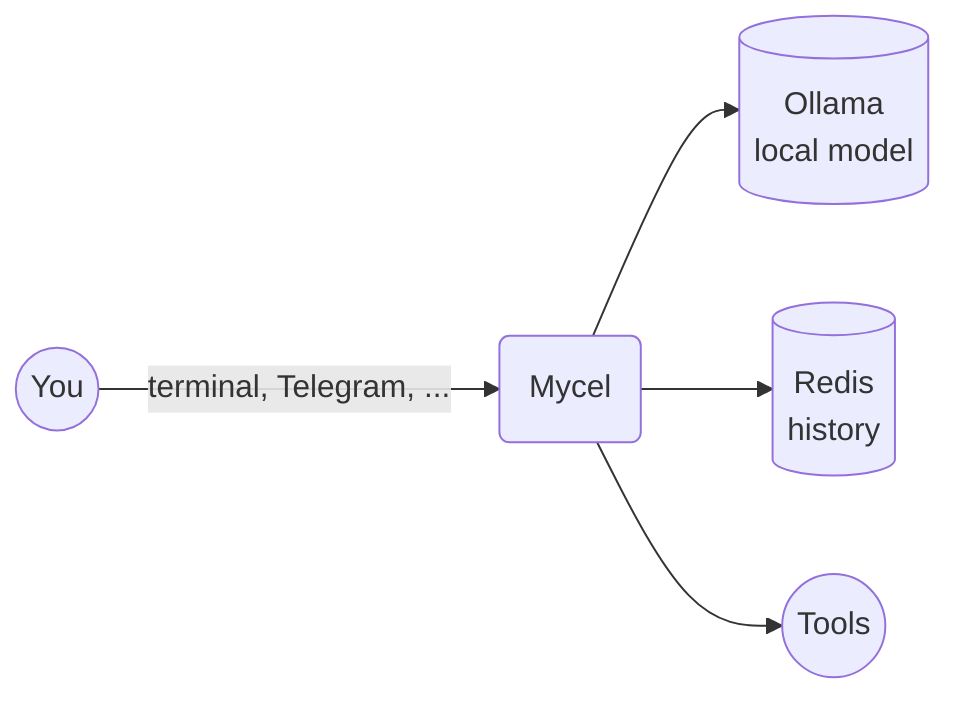

# Mycel

Mycel is a personal AI assistant that runs on your own machine. It talks to a local model through [Ollama](https://ollama.com), remembers your conversations across sessions, and is reachable from more than one [platform](platforms/index.md) at once — the terminal and a Telegram chat today, more as they get added.

Beyond conversation it can act: it reaches for a [tool](tools/index.md) — searching the web, reading a page, reading your files, sending an email — whenever a reply on its own isn't enough.

## How it works

One process runs the agent, whichever platform a message arrives on: the same model, the same history and the same tools answer it, and switching platforms mid-conversation picks the thread back up rather than starting a new one. The model and the conversation history run locally, so nothing is sent anywhere just to be answered — what does leave your machine is only what a tool you asked for actually does, such as a search or a page fetch.

## Get started

**[Install Mycel →](setup/automatic.md)**
